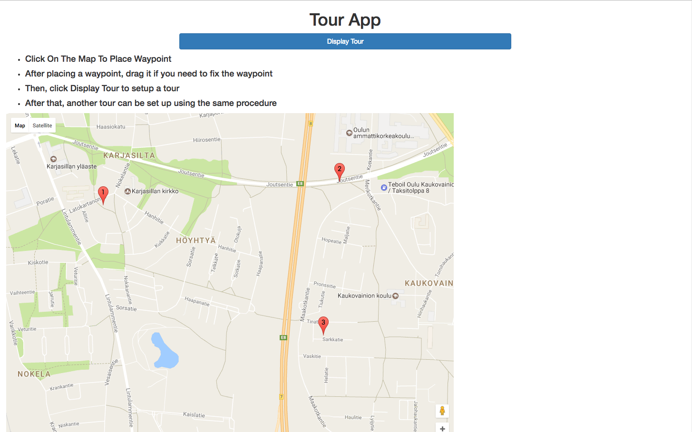
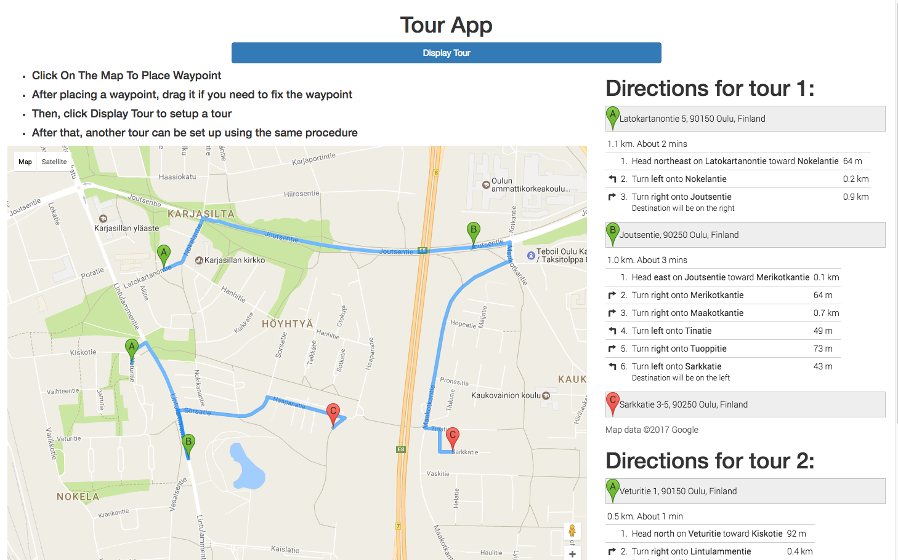

# Simple Map Tour

Simple web app that can setup waypoints for tour

# Technologies

I use Angular 1 + ng-map library for Google Map API interaction.

# Installation

Clone the project and run index.html

# Usage

+ Users can place waypoint by clicking on the map
+ After placing a waypoint, drag it to change the location of the waypoint
+ Remove a waypoint by clicking on that waypoint
+ Finally, click Display Tour to set up a tour
+ After that, another tour can be set up using the same procedure

# Demo

